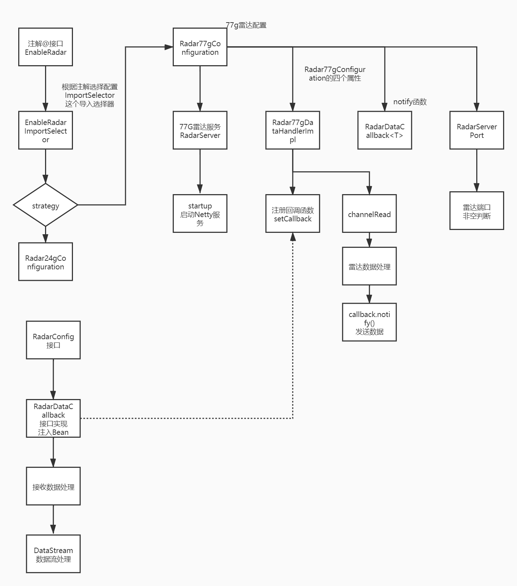

# 介绍

该SDK功能，使用Netty起了一个TCP 服务器，接收雷达设备传输的数据。

主要技术框架栈：

- Netty
- 回调函数

# 流程图



# 快速开始

## 1、打包
命令行：
> mvn assembly:assembly

也可使用IDEA等工具打包

## 2、使用
使用**radar-sdk-jar-with-dependencies.jar**，不需要在使用该雷达SDK的项目中引用所需依赖
### 2.1 引入**radar-sdk-jar-with-dependencies.jar**包
项目根目录下新建lib文件夹
在POM文件中添加依赖坐标
```xml
        <dependency>
            <groupId>com.yinyuan</groupId>
            <artifactId>radarsdk</artifactId>
            <scope>system</scope>
            <systemPath>${project.basedir}/lib/radar-sdk-jar-with-dependencies.jar</systemPath>
        </dependency>
```
>注意，如果不使用带-jar-with-dependencies的jar包，需手动导入其依赖的第三方依赖

### 2.2 进行雷达配置
**实现RadarConfig接口**

例：
```java
@Configuration //注意需要加次注解，不然无法完成依赖注入
public class RadarConfigImpl implements RadarConfig {

    //只需要重写以下三方法

    /**
     * 配置24G雷达的服务端口
     * @return
     */
    @Bean //注意需要加次注解，不然无法完成依赖注入
    @Override
    public RadarServerPort radar24gPort() {
        //1081是24G雷达需要连接的端口号,可更改
        return new RadarServerPort(1081);
    }

    /**
     * 配置77G雷达的服务端口
     * @return
     */
    @Bean //注意需要加次注解，不然无法完成依赖注入
    @Override
    public RadarServerPort radar77gPort() {
        //1082是77G雷达需要连接的端口号,可更改
        return new RadarServerPort(1082);
    }

    /**
     * 雷达回调函数，雷达的数据通过次接口的实现进行通知
     * @return
     */
    @Bean
    @Override
    public RadarDataCallback<String> radarDataCallback() {
        return new RadarDataCallback<String>() {
            @Override
            public void notify(String s) {
                System.out.println("接收到的雷达数据：" + s);
            }
        };
    }

}
```

## 2.3 开启雷达服务
使用 **@EnableRadar**开启雷达服务，有三种策略：
>RadarOpenStrategy.RADAR_24G   //仅开启24G
RadarOpenStrategy.RADAR_77G    //仅开启77G
RadarOpenStrategy.RADAR_BOTH   //同时开启24G和77G

例：
在**主启动类**或上一步的**RadarConfigImpl.java**中添加此注解
```java
@SpringBootApplication
@EnableRadar(strategy = RadarOpenStrategy.RADAR_BOTH)
public class DemoApplication {

    public static void main(String[] args) {
        SpringApplication.run(DemoApplication.class, args);
    }

}
```

# 3、数据格式
>收到的数据均是JSON数据格式
 ## 3.1 24G雷达数据格式
 心跳数据
 ```json
{
    "dataType": "Radar_24G", 
    "sn": "372781383"
}
 ```
 目标数据
 ```json
{
    "dataType": "Radar_24G", 
    "sn": "372781383", 
    "data": [
        {
            "tid": 1, 
            "posX": 0.1, 
            "posY": 1.7, 
            "distance": 1.7, 
            "speed": -0.09, 
            "angle": 2.77, 
            "power": 56.7
        }
    ]
}
 ```
 ## 3.2 77G雷达数据格式
 心跳数据
 ```json
{
    "dataType": "Radar_77G", 
    "sn": "12801"
}
 ```
 目标数据
 ```json
{
    "dataType": "Radar_77G", 
    "sn": "12801", 
    "data": [
        {
            "posX": 0.14255768, 
            "posY": 0.7642392, 
            "accY": 0.017509371, 
            "accX": 0.41480064, 
            "velY": -0.117916174, 
            "velX": 0.03474365, 
            "tid": 6
        }
    ]
}
 ```
